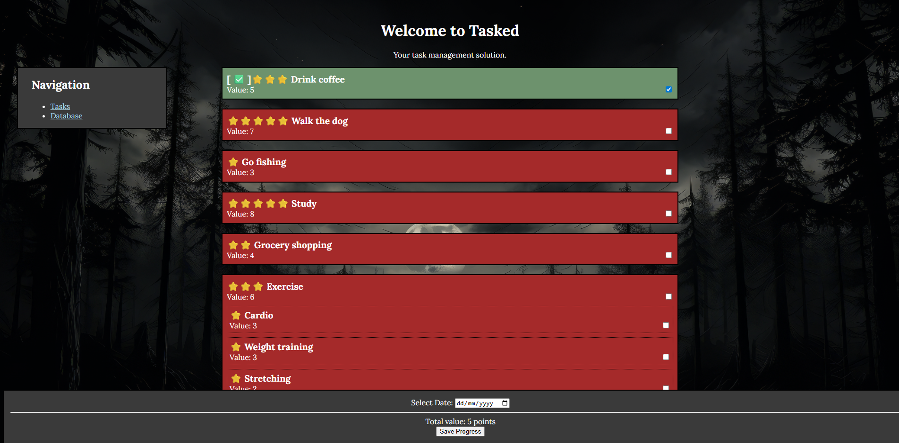

# Tasked
App that allows to calculate points from tasks and stores them.

## Background
In daily life, people perform many tasks - some routine, some ambitious - but often lack a clear way to evaluate
how productive they truly are. Traditional productivity tracking relies on subjective perception rather than measurable results.
By assigning points to completed tasks and summing them over each day, productivity becomes quantifiable rather than intuitive.
Tracking these point totals over time enables individuals to reflect on how their habits change and how consistent their
performance is. In the long term, this system can evolve into a statistical productivity tracker, offering insights
like average productivity level, distribution patterns, and standard deviation.

## Description
You select tasks you did during some day. You select which day it was, then, once saved, can be viewed from a menu.
Selected tasks are displayed in green. Some tasks contain sub-tasks, allthough they act standalone.
Each task has a value associated (and a star rating based on the value). When clicked, it adds to the sum of points for the day.
When save button is pressed, every task gets stored in the database. You can view the database and see which tasks were
performed during that date.

## Target Audience
- Students and professionals seeking quantifiable feedback on their daily work output.
- Individuals who want a straightforward method to track and improve personal productivity.
- Habit-builders and self-improvement enthusiasts who benefit from data-driven reflection.
- People interested in monitoring long-term patterns and optimizing time-management strategies.
- Developers or researchers exploring quantified-self tools and productivity analytics.

## UI

## Areas for Improvement
It requires Apache and a database system. There should be version which doesn’t require them. It would use .html
files, and tasks would be saved into .txt files which would act as database records. Better visuals could
be achieved as well.